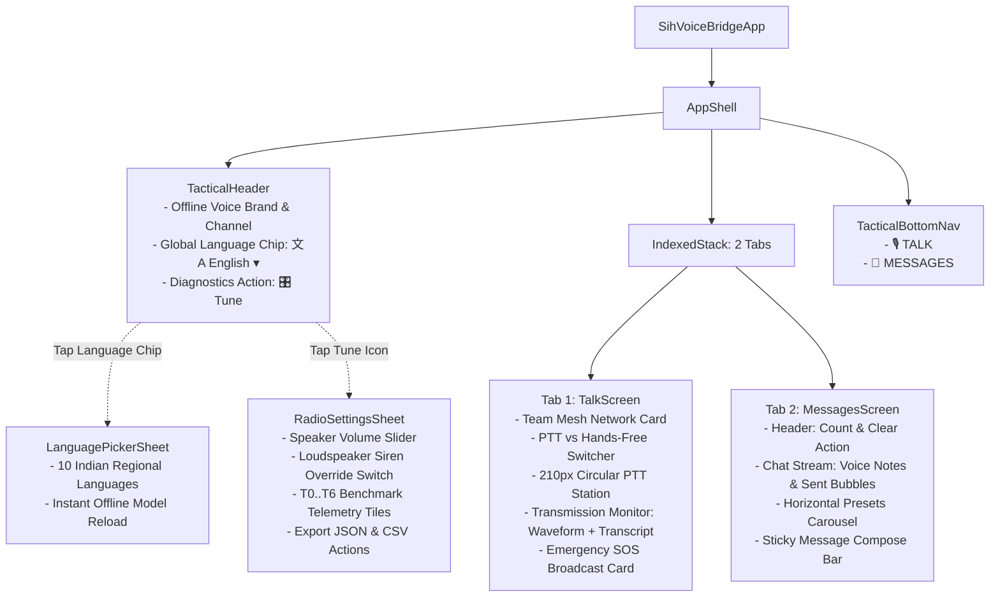
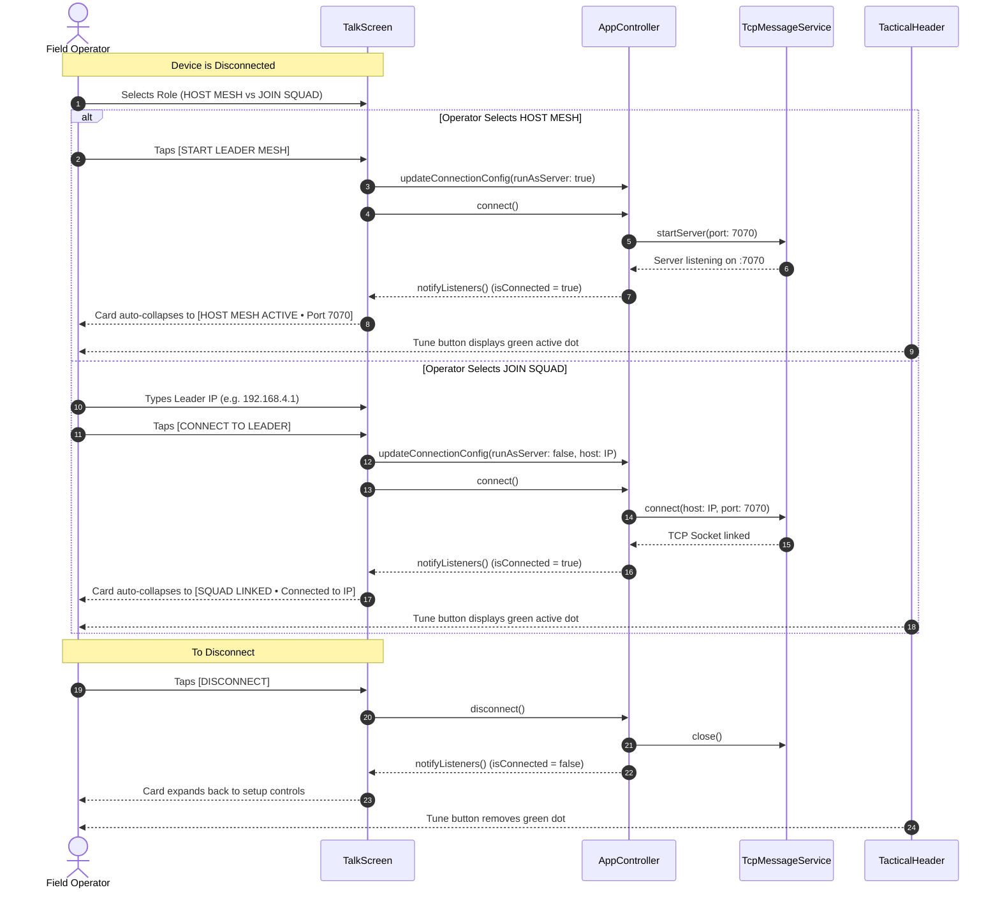
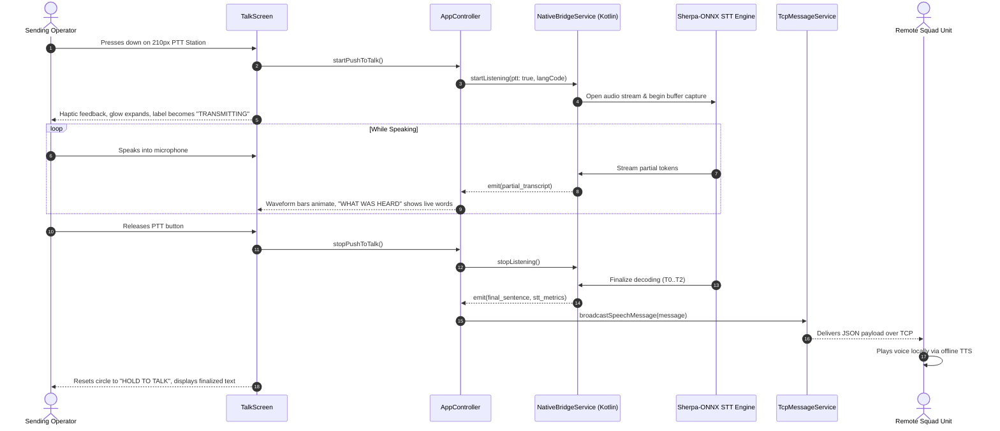
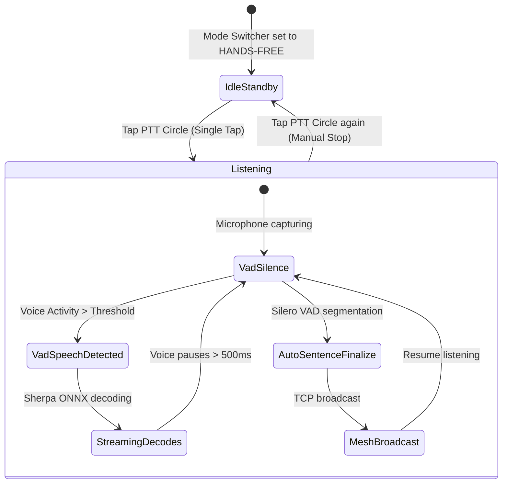
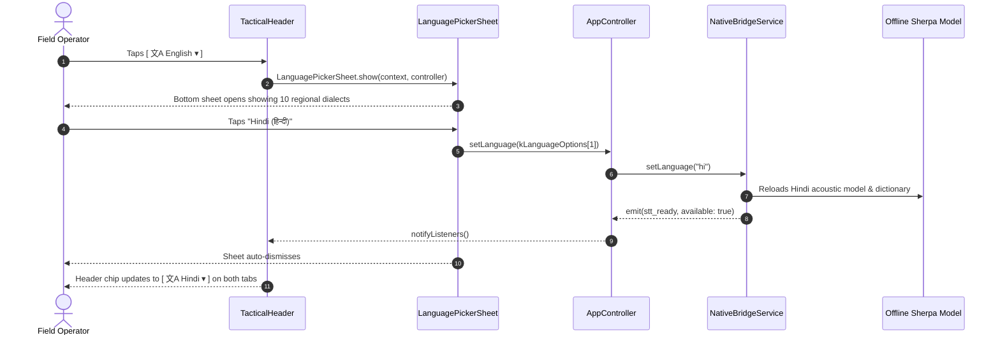
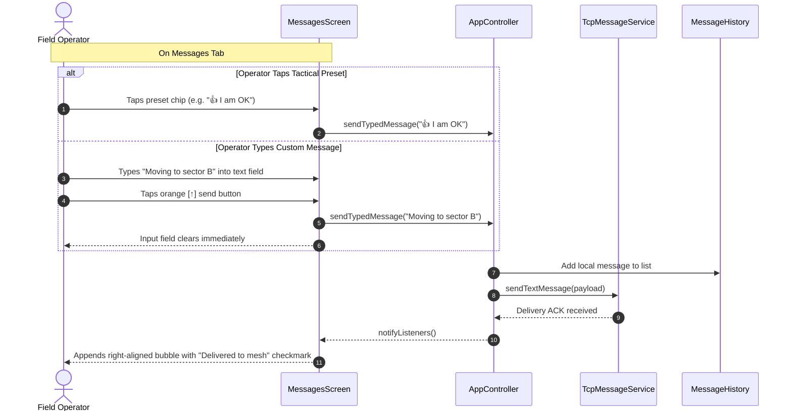
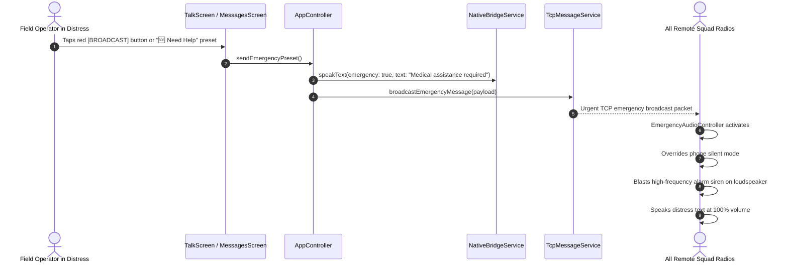
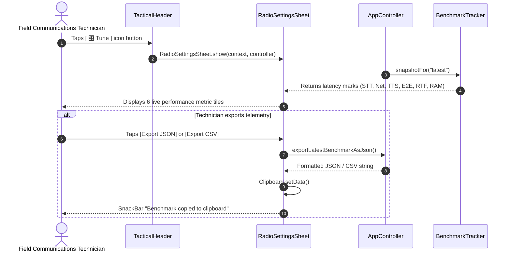

# iTantra: UI Map, Architecture & User Flow Guide

This document serves as the authoritative, human- and AI-readable specification of the **iTantra Offline Multilingual Transceiver** user interface, information architecture (IA), component hierarchy, interaction state machines, and end-to-end user journeys.

---

## 1. High-Level Information Architecture (IA)

The application operates as an offline, zero-internet tactical voice-and-text transceiver. Its user interface is structured around a focused **2-tab cockpit architecture** with persistent top-level tactical controls and two contextual modal sheets:



---

## 2. Screen & Component Hierarchy

### Root Entrypoint & Shell
- [`lib/main.dart`](file:///home/tanishq/Projects/offline-multilingual-transceiver/lib/main.dart): App entrypoint; calls `runApp(const SihVoiceBridgeApp())`.
- [`lib/app/app.dart`](file:///home/tanishq/Projects/offline-multilingual-transceiver/lib/app/app.dart): Initializes [`AppController`](file:///home/tanishq/Projects/offline-multilingual-transceiver/lib/app/state/app_controller.dart), configures dark tactical theme via [`AppTheme.dark()`](file:///home/tanishq/Projects/offline-multilingual-transceiver/lib/app/theme/app_theme.dart), and mounts [`AppShell`](file:///home/tanishq/Projects/offline-multilingual-transceiver/lib/app/ui/app_shell.dart).
- [`lib/app/ui/app_shell.dart`](file:///home/tanishq/Projects/offline-multilingual-transceiver/lib/app/ui/app_shell.dart): Houses the `Scaffold` with `IndexedStack` (Talk & Messages tabs), sticky `TacticalHeader`, and frosted glass `TacticalBottomNav`.

```
lib/app/ui/
├── app_shell.dart                  # 2-Tab Cockpit Shell & Bottom Navigation
├── screens/
│   ├── talk_screen.dart            # Primary Walkie-Talkie & Mesh Control Hub
│   └── messages_screen.dart        # Chat Transcripts, Presets & Text Dispatch
└── widgets/
    ├── tactical_header.dart        # Persistent Top Header with Global Controls
    ├── language_picker_sheet.dart  # 1-Tap Dialect Selection Bottom Modal
    ├── radio_settings_sheet.dart   # Audio Volume & Precision Benchmarks Modal
    ├── pulsing_dot.dart            # Animated Tactical Status Beacon Dot
    └── transmission_preview.dart   # Audio Preview & Waveform Display Helper
```

---

### Component Breakdown

#### A. Persistent Top Header: [`TacticalHeader`](file:///home/tanishq/Projects/offline-multilingual-transceiver/lib/app/ui/widgets/tactical_header.dart)
Positioned at `top: 0, left: 0, right: 0` across all screens with a frosted backdrop filter (`ImageFilter.blur(sigmaX: 16, sigmaY: 16)`).
1. **Brand Mark & Channel Indicator**:
   - Tactical sensor icon (`Icons.sensors`) in amber outline.
   - Title: `OFFLINE VOICE`.
   - Active channel badge: `CH 01 • RELIEF MESH`.
2. **Global Language Picker Chip**:
   - Formatted as `[ 文A English ▾ ]`.
   - Tapping invokes `LanguagePickerSheet.show(context, controller)`.
   - Visible and reactive on both Talk and Messages screens with zero widget duplication.
   - Complies with 48x48 tap target accessibility guidelines.
3. **Diagnostics / Settings Action (`[ 🎛 Tune ]`)**:
   - Square tactical icon button with connection dot badge (green dot appears when connected to mesh).
   - Tapping invokes `RadioSettingsSheet.show(context, controller)`.

---

#### B. Tab 1: [`TalkScreen`](file:///home/tanishq/Projects/offline-multilingual-transceiver/lib/app/ui/screens/talk_screen.dart)
The operational core for zero-latency voice transmission and direct local mesh networking:
1. **Team Mesh Network Card** (`_buildTeamMeshCard`):
   - **Disconnected State**:
     - Header: `TEAM MESH NETWORK` with `OFFLINE DIRECT` status.
     - Segmented toggle: `[ HOST MESH (Server) | JOIN SQUAD (Client) ]`.
     - When `JOIN SQUAD` selected: Displays `Leader IP` text input (default: `192.168.4.1`).
     - Action button: Full-width high-contrast button (`START LEADER MESH` in emerald green or `CONNECT TO LEADER` in electric cyan).
   - **Connected State**:
     - Auto-collapses into a sleek 48px-high banner.
     - Live pulsing beacon dot (`PulsingDot(ping: true)`).
     - Status readout: `HOST MESH ACTIVE • Broadcasting on Port 7070` or `SQUAD LINKED • Connected to <IP>`.
     - High-contrast red `DISCONNECT` button.
2. **Operation Mode Switcher** (`_buildModeSwitcher`):
   - Centered pill with smooth animated sliding indicator:
     - `PTT`: Push-to-Talk walkie-talkie mode.
     - `HANDS-FREE`: Continuous background speech recognition with Silero VAD segmentation.
3. **Central Push-to-Talk Station** (`_buildPttStation`):
   - 210px circular station with breathing glow animation (`boxShadow` expands on active speech).
   - Microphone icon inside an inner ambient circle.
   - Dynamic label: `HOLD TO TALK` (or `TAP TO SPEAK` in hands-free), switching to `TRANSMITTING` when mic is active.
   - Instruction: `"Hold anywhere on circle to speak • Release to send"`.
4. **Transmission Monitor** (`_buildTransmissionMonitor`):
   - Real-time audio waveform equalizer: 6 vertical animated equalizer bars driven by mic input.
   - Transcript card: Displays live partial STT text as words are spoken, or the latest finalized transmission.
5. **Emergency SOS Card** (`_buildEmergencySosBar`):
   - High-contrast crimson alert card with warning beacon icon.
   - Title: `EMERGENCY SOS • Broadcast urgent distress beacon`.
   - Action button: Red `BROADCAST` button that transmits distress packet with loudspeaker override.

---

#### C. Tab 2: [`MessagesScreen`](file:///home/tanishq/Projects/offline-multilingual-transceiver/lib/app/ui/screens/messages_screen.dart)
The persistent transmission history and dispatch interface:
1. **Sub-Header Action Bar**:
   - Label: `RECENT DISPATCHES`.
   - Live counter: `X messages recorded` (or `Offline radio storage clear`).
   - 1-tap `Clear` button with confirmation to wipe local radio history.
2. **Message Stream** (`ListView`):
   - **Incoming Voice Notes**:
     - Sender badge: `Remote Unit` with timestamp and dialect circular tag (e.g. `HI`, `TA`, `EN`).
     - Transcript bubble: `“<Transcribed text>”`.
   - **Outgoing Local Dispatches**:
     - Aligned to right with amber border.
     - Title: `YOU SENT` with timestamp.
     - Status: `Delivered to mesh` with double-checkmark icon (`Icons.done_all`).
   - **Emergency Transmissions**:
     - Crimson container with hazard stripes and `EMERGENCY SOS DISPATCH` header.
3. **Sticky Bottom Compose Bar** (`_buildStickyCompose`):
   - **Horizontal Presets Action Tray**:
     - Ergonomic horizontal scrolling row of tactical quick chips:
       - `👍 I am OK`
       - `🆘 Need Help` (Crimson emergency style)
       - `📍 Arrived at Location`
       - `📡 Check In`
     - Tapping dispatches immediate packet over TCP mesh.
   - **Text Input & Dispatch Row**:
     - Rounded pill container with hint `"Type a dispatch message..."`.
     - 48x48 circular orange dispatch button (`Icons.arrow_upward`).
     - Ergonomic bottom padding: `MediaQuery.paddingOf(context).bottom + 10` ensuring zero wasted dead-space above the bottom nav bar.

---

#### D. Modal 1: [`LanguagePickerSheet`](file:///home/tanishq/Projects/offline-multilingual-transceiver/lib/app/ui/widgets/language_picker_sheet.dart)
Triggered by tapping the language chip in the header:
- Modal bottom sheet with blurred backdrop.
- Lists all 10 supported Indian regional languages:
  1. English (`en`)
  2. Hindi / हिन्दी (`hi`)
  3. Gujarati / ગુજરાતી (`gu`)
  4. Marathi / मराठी (`mr`)
  5. Kannada / ಕನ್ನಡ (`kn`)
  6. Malayalam / മലയാളം (`ml`)
  7. Tamil / தமிழ் (`ta`)
  8. Telugu / తెలుగు (`te`)
  9. Bengali / বাংলা (`bn`)
  10. Punjabi / ਪੰਜਾਬੀ (`pa`)
- Each card shows: Circular dialect code badge, English name, native script title, and checkmark if selected.
- 1-tap switches active offline Sherpa-ONNX model and dismisses sheet.

---

#### E. Modal 2: [`RadioSettingsSheet`](file:///home/tanishq/Projects/offline-multilingual-transceiver/lib/app/ui/widgets/radio_settings_sheet.dart)
Triggered by tapping the `Tune` button (`[ 🎛 Tune ]`) in the header:
- **Speaker & Alerts**:
  - `Incoming Voice Volume` slider (0% to 100%).
  - `Emergency Siren Override` switch: Forces emergency broadcasts onto loudspeaker at full volume.
- **Technician Benchmarks (T0..T6)**:
  - 6 precision telemetry tiles displaying live hardware & model performance:
    1. `STT LATENCY` (ms)
    2. `NETWORK` latency (ms)
    3. `TTS LATENCY` (ms)
    4. `END-TO-END` latency (ms)
    5. `RTF SPEED` (Real-Time Factor speed ratio)
    6. `PEAK RAM` (MB memory footprint)
- **Data Export Actions**:
  - `Export JSON`: Copies complete benchmark JSON payload to clipboard.
  - `Export CSV`: Copies tabular benchmark row to clipboard.
- **Hardware Footer**: `OFFLINE VOICE RADIO V2.4.1 • PEER #FD-89A`.

---

## 3. End-to-End User Flows & State Machines

### Flow 1: Team Mesh Network Setup & Connection



---

### Flow 2: Push-to-Talk (PTT) Voice Transmission



---

### Flow 3: Hands-Free Continuous Voice Transmission



---

### Flow 4: Dialect / Language Selection from Header



---

### Flow 5: Tactical Preset & Text Message Dispatch



---

### Flow 6: Emergency SOS Distress Beacon



---

### Flow 7: Precision Diagnostics & Benchmark Telemetry



---

## 4. UI-to-State Architecture & Binding Table

All UI elements bind directly to [`AppController`](file:///home/tanishq/Projects/offline-multilingual-transceiver/lib/app/state/app_controller.dart) via Flutter's reactive `AnimatedBuilder` pattern.

| UI Component | User Action | Controller Method / Property | Underlying Service & Backend Call |
| :--- | :--- | :--- | :--- |
| **Header Language Chip** | Tap chip | `LanguagePickerSheet.show()` | Opens sheet |
| **Language Sheet Item** | Tap language | `controller.setLanguage(opt)` | `NativeBridgeService.setLanguage()` -> Kotlin `OfflineSttSession.loadModel()` |
| **Header Tune Button** | Tap button | `RadioSettingsSheet.show()` | Reads `controller.latestBenchmark` & `resourceBenchmark` |
| **Mesh Role Switcher** | Tap Host / Join | `controller.updateConnectionConfig()` | Updates in-memory `ConnectionConfig` |
| **Leader IP Input** | Enter text | `controller.updateConnectionConfig()` | Updates `ConnectionConfig.host` |
| **Mesh Connect Button** | Tap button | `controller.connect()` | `TcpMessageService.startServer()` or `.connect()` |
| **Mesh Disconnect** | Tap Disconnect | `controller.disconnect()` | `TcpMessageService.close()` |
| **Mode Pill** | Tap PTT / Hands-Free | `controller.setOperationMode()` | `NativeBridgeService.setOperationMode()` |
| **PTT Station (Walkie)** | Press down | `controller.startPushToTalk()` | `NativeBridgeService.startListening(ptt: true)` -> Audio buffer |
| **PTT Station (Walkie)** | Release | `controller.stopPushToTalk()` | `NativeBridgeService.stopListening()` -> Decode final |
| **PTT Station (Hands-Free)**| Tap once | `controller.startPushToTalk()` | Continuous Silero VAD listening |
| **PTT Station (Hands-Free)**| Tap to stop | `controller.stopPushToTalk()` | Stops continuous listening |
| **Emergency SOS Button** | Tap Broadcast | `controller.sendEmergencyPreset()` | `TcpMessageService` emergency broadcast + Siren |
| **Preset Chips** | Tap chip | `controller.sendTypedMessage()` | TCP JSON payload dispatch |
| **Message Input Field** | Submit text / tap [↑] | `controller.sendTypedMessage()` | TCP JSON payload dispatch |
| **Clear History Button** | Tap Clear | `controller.clearHistory()` | Clears `controller.history` memory list |
| **Export JSON / CSV** | Tap export | `exportLatestBenchmarkAsJson()` | Formats `BenchmarkTracker` telemetry data |

---

## 5. Design System & Theming Tokens

Defined in [`lib/app/theme/app_colors.dart`](file:///home/tanishq/Projects/offline-multilingual-transceiver/lib/app/theme/app_colors.dart) and [`lib/app/theme/app_typography.dart`](file:///home/tanishq/Projects/offline-multilingual-transceiver/lib/app/theme/app_typography.dart):

### Color Tokens
- **Background & Canvas**:
  - Base Background: `AppColors.background` (`#0F131C`)
  - Elevated Container: `AppColors.surfaceContainerLow` (`#131B26`)
  - Deep Ground: `AppColors.surfaceContainerLowest` (`#06090E`)
  - Outlines / Dividers: `AppColors.outline` (`#2D3D54`)
- **Action Accents**:
  - Primary (Amber): `AppColors.primary` (`#F97316`) — PTT active, send button, key accents.
  - Secondary (Electric Cyan): `AppColors.secondary` (`#06B6D4`) — Client connection, telemetry, channel tags.
  - Tertiary (Emerald Green): `AppColors.tertiary` (`#10B981`) — Server host mesh, active pulse, delivered status.
  - Error (Crimson): `AppColors.error` (`#EF4444`) — Emergency SOS beacon, disconnect action.

### Accessibility Standards
- **Minimum Tap Target**: Minimum `48x48 dp` on Android (`androidTapTargetGuideline`) and `44x44 dp` on iOS (`iOSTapTargetGuideline`) across all buttons, pills, chips, and list items.
- **Contrast**: Strict compliance with WCAG AA (minimum 4.5:1 contrast ratio) for all typography against dark containers.
- **Screen Readers**: Full semantic labels, hints, and button roles (`Semantics(button: true, label: ...)`) for vision-impaired operators.
